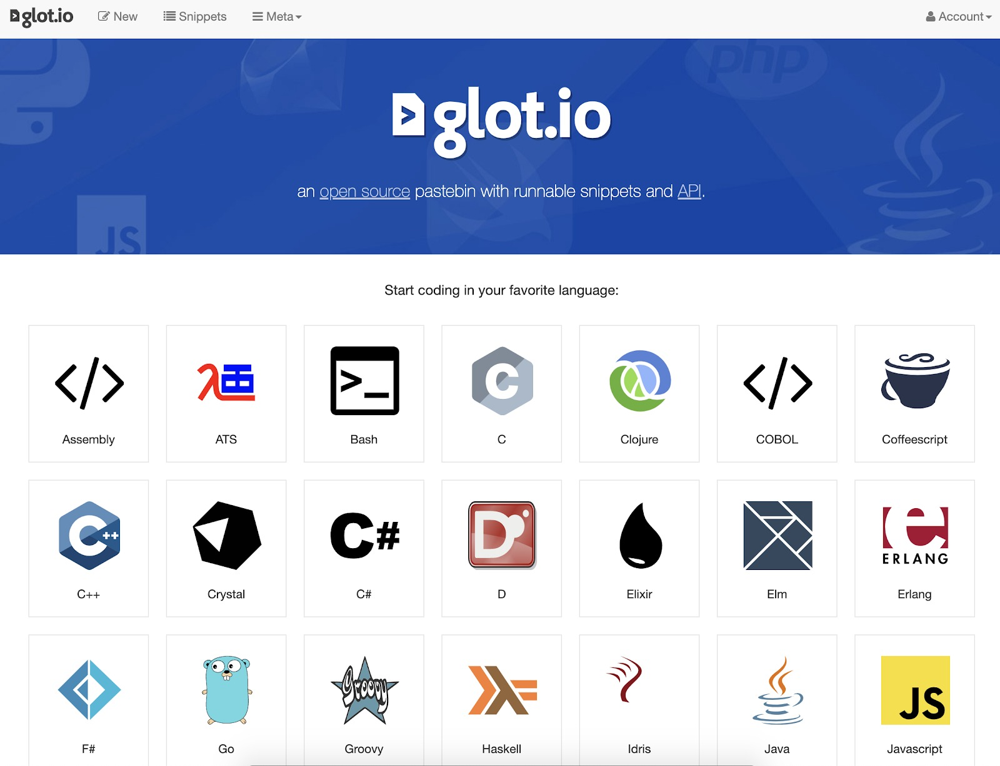

# Tools
Sebelum berperang, kita harus siapkan senjatanya terlebih dahulu. Demikian halnya dengan *programming*. Sebelum *coding* maka kita harus memastikan *tools* apa yang akan kita pakai. *Tools* pertama yang terpenting adalah Java Development Kit (JDK).

## Java Development Kit (JDK)
Java Development Kit adalah *tools* yang digunakan seorang *developer* dalam proses *developing*, *debugging*, dan *monitoring* suatu aplikasi Java. Di dalam JDK juga terdapat Java Runtime Environment yang digunakan untuk menjalankan suatu aplikasi Java.

**How to install JDK**
Instal Java Development Kit yang bisa kita dapatkan pada tautan berikut:
[https://www.oracle.com/java/technologies/javase/javase-jdk8-downloads.html](https://www.oracle.com/java/technologies/javase/javase-jdk8-downloads.html)

**Catatan:**
Di sini kita menggunakan JDK 8(bukan yang terbaru) karena kebanyakan produk masih menggunakan Java 8. Cek [di sini](https://www.marcobehler.com/guides/a-guide-to-java-versions-and-features#_why_are_companies_still_stuck_with_java_8) untuk lebih lengkapnya.

Biasanya muncul pertanyaan, "Apakah JRE cukup?" Tidak, JRE adalah Java Runtime Environment yang berfungsi sebagai Virtual Machine untuk menjalankan program Java. Sedangkan JDK merupakan Java SE Development Kit, di mana JRE juga terdapat di dalamnya. Dan yang lebih penting adalah di dalamnya terdapat *compiler* dan *tools* untuk membuat dan compile program.

Sederhananya JRE untuk menjalankan program, sedangkan JDK untuk membuat program. Mari kita mulai dengan proses instalasi dari JDK dari Oracle.

1. Langsung saja buka tautan di atas menggunakan browser Anda. Pilihlah *link download* yang sesuai dengan OS yang Anda pakai.

2. Jangan lupa untuk mencentang *Accept License Agreement* dan klik tombol Download.

3. Anda akan diminta untuk login terlebih dahulu, silakan mendaftar dulu jika Anda belum memiliki akun.
4. Setelah proses mengunduh selesai, langsung *install* ke gawai Anda dan ikuti petunjuknya sampai selesai.

**Update PATH Environment Variable (Opsional)**
Anda dapat menjalankan JDK tanpa pengaturan enviroment PATH atau secara opsional mengaturnya agar dapat menjalankan berkas java ((javac.exe, java.exe, javadoc.exe, dan sebagainya) dari directory manapun. Jika Anda tidak mengatur variabel PATH, maka Anda perlu menentukan jalur lengkap/lokasi ke berkas yang dapat dieksekusi setiap kali Anda menjalankannya, seperti:

```
C:\> "C:\Program Files\Java\jdk1.8.0\bin\javac" MyClass.java
```

"C:\Program Files\Java\jdk1.7.0\bin\javac" merupakan lokasi dari JDK yang biasanya akan secara default ada. Di sini contoh versi yang digunakan adalah jdk 1.7.0. Di dalamnya ada folder bin dan javac.

Lalu bagaimana cara mengaturnya? Caranya mudah kok, yakni:

1. Klik **Start**, kemudian pilih **Control Panel**, dan pilih **System**.
2. Kemudian klik **Advanced** dan pilih **Environment Variables**.
3. Tambahkan lokasi folder **bin** dari JDK untuk **variabel PATH** di Variabel Sistem. Berikut ini adalah nilai tipikal untuk variabel PATH:
    ```
      C:\WINDOWS\system32;C:\WINDOWS;C:\Program Files\Java\jdk1.8.0\bin
    ```
    Tentu sesuaikan dengan lokasi dari java yang ada dalam PC Anda.

4. Jika sudah Klik OK atau Apply untuk mengakhirinya.
5. Untuk memastikan apakah gawai sudah mengetahui tentang infomasi jdk, Anda bisa menjalankan perintah ```java -version``` (Windows) atau ```javac -version``` (Linux/MacOS).

Tentu beda OS akan mempengaruhi cara pengaturan PATH Environment Variable.

## Develop, Debug, dan Monitor
Apa itu *develop*, debug dan monitor? *Develop* adalah proses penyusunan baris per baris kode sampai menjadi satu aplikasi utuh yang memiliki suatu fungsi. Tujuan akhir yang ingin dicapai akan mempengaruhi kompleksitas proses *development*. Tak peduli betapa rumitnya proses *development*, kesalahan mungkin terjadi. Kesalahan ini kita sebut sebagai *bug*, yakni  eror yang dapat membuat aplikasi kita tidak dapat berjalan seperti keinginan. Di sinilah muncul istilah debug, yakni proses mencari dan menghilangkan eror tersebut di dalam aplikasi untuk kemudian memperbaikinya. Dan terakhir, monitor adalah proses untuk mengamati jalannya aplikasi dari yang kita buat. Biasanya ini berhubungan dengan performa aplikasi dengan *environment* di mana ia dijalankan. Intinya, JDK adalah *tools* wajib yang harus digunakan oleh seorang developer Java untuk membuat suatu aplikasi dari nol hingga selesai.

## Integrated Development Environment (IDE)
Untuk membuat suatu aplikasi Java sebenarnya cukup dengan teks editor dan *command line*. Editor digunakan untuk menuliskan baris kodenya sementara *command line* digunakan untuk menjalankan perintah Java. Akan tetapi, saat ini sudah ada IDE yang membantu tidak hanya dalam proses *developing*, bahkan hingga optimasinya.

Biasanya di dalam IDE terdapat *source code editor*, *build automation tools*, dan *debugger*. Fitur lainnya adalah *code completion* yang sangat berguna terkait efisiensi penulisan kode. IDE juga biasanya dilengkapi dengan *version control system* yang bermanfaat untuk *versioning* suatu aplikasi. Beberapa IDE juga memiliki *tools* untuk membuat tampilan *(layout)* dalam *Graphical User Interface* (GUI), sehingga kita bisa membuat suatu tampilan dengan cara *drag-and-drop*.

IDE saat ini sudah menjadi *tools* wajib untuk memaksimalkan produktivitas seorang *developer* dalam membuat suatu aplikasi. Seperti perumpamaan sebelumnya, IDE adalah senjata *developer*. Semakin canggih dan tingginya kita menguasai senjata tersebut, semakin ampuh juga efeknya.

*Tools* yang akan digunakan di dalam kelas ini adalah :
* **OpenJDK**, yakni *free open source* di bawah lisensi **GNU** *General Public License*.
* **Intellij**, adalah IDE untuk Java development yang dikembangkan oleh **JetBrains**.

Namun demikian, untuk mengikuti kelas ini, penggunaan Intellij dan OpenJDK tidaklah bersifat wajib. Anda boleh menggunakan *tools* Java lainnya, tetapi lebih disarankan memakai *tools* bahasan materi ini. Tujuannya, untuk mengurangi potensi kesalahan teknis atau lainnya.

## Cara Install Intellij

1. Unduh Intellij di tautan ini [https://www.jetbrains.com/idea/download/](https://www.jetbrains.com/idea/download/). (Anda bisa menggunakan versi Community)

2. Ikuti langkah-langkah di bawah ini untuk proses instalasinya.
3. Jalankan *installer* yang sudah Anda unduh:

4. Pilihlah lokasi di mana Anda hendak menyimpan aplikasi tersebut.

5. Centang pilihan *launcher* sesuai dengan versi OS yang Anda gunakan (32 atau 64) bit. Perintah tersebut membuat *launcher* nampak di desktop. Anda pun bisa dengan mudah mengakses Intellij.

6. Untuk start menu biarkan pilihan *default*-nya tetap *intact*.

7. Tunggu sampai prosesnya selesai.

8. Saat selesai, klik *Finish*.


Untuk petunjuk pemakaian yang resmi dari Intellij, silakan lihat tautan ini [https://www.jetbrains.com/help/idea/meet-intellij-idea.html](https://www.jetbrains.com/help/idea/meet-intellij-idea.html).

## IDE Online
Jika Anda mengalami kesulitan, Anda bisa menggunakan glot.io dan repl.it. 

**Glot.io**
Untuk glot.io, silakan ikuti cara-cara berikut:

1. Pertama bukalah halaman [https://glot.io/](https://glot.io/).

2. Selanjutnya, pilih bahasa Java karena Anda akan mempelajari bahasa ini.

3. Selanjutnya, Anda bisa ***ubah nama proyek*** dan ***nama berkas*** yang Anda buat dan tentunya Anda bisa memulai menuliskan baris kode di dalamnya.

Terdapat beberapa tombol pada gambar di atas, di antaranya:
    1. tombol ***Run*** digunakan untuk menjalankan kode,
    2. tombol ***Input*** digunakan untuk memasukkan teks ke dalam program yang dijalankan,
    3. tombol ***Output*** digunakan untuk menampilkan hasil dari program yang dijalankan,
    4. dan tombol ***Save*** digunakan untuk menyimpan berkas yang sudah dibuat.
4. Anda juga bisa membuat beberapa berkas di dalam proyek ini dengan menekan tombol *add* (+), seperti gambar di bawah:


**Replit**
Sedangkan untuk repl.it, silakan ikut cara-cara berikut:
1. Pertama, buka halaman [repl.it](repl.it).
[gambar](img/14.png)
2. Selanjutnya klik tombol **Start coding**, kemudian pilih bahasa **Java**.

    Setelah itu, klik tombol **Create repl**.
3. Nah dengan begitu, Anda akan disuguhkan halaman untuk menuangkan kode-kode Java Anda.

    Di bagian kiri merupakan stuktur project, bagian tengah merupakan tempat menuangkan kode Java, dan bagian kanan merupakan tempat *input/output* program.

Jadi seperti itulah beberapa tools yang bisa Anda gunakan untuk membangun program Java, baik IDE offline (Intellij Idea) maupun IDE online (Replit dan Glot.io).

----
[Sebelumnya](../01-pengantar-java/index.md)
[Selanjutnya](../03-membangun-project-java/index.md)