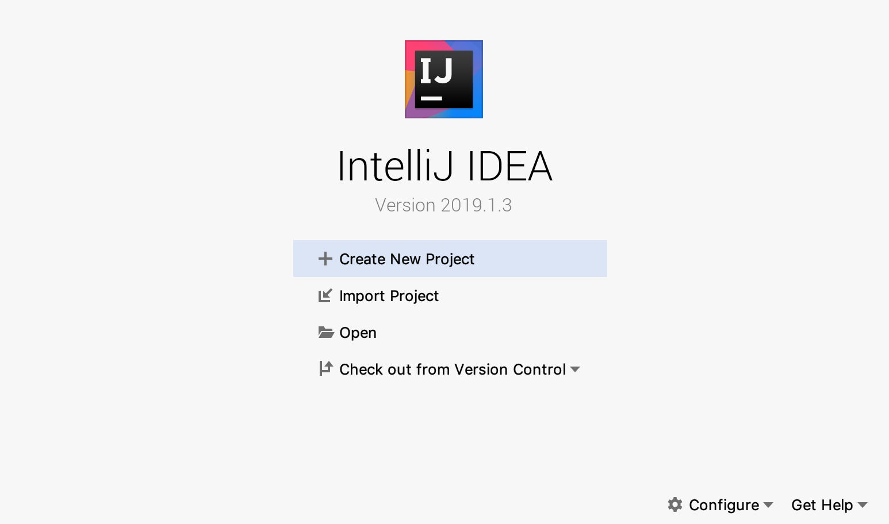
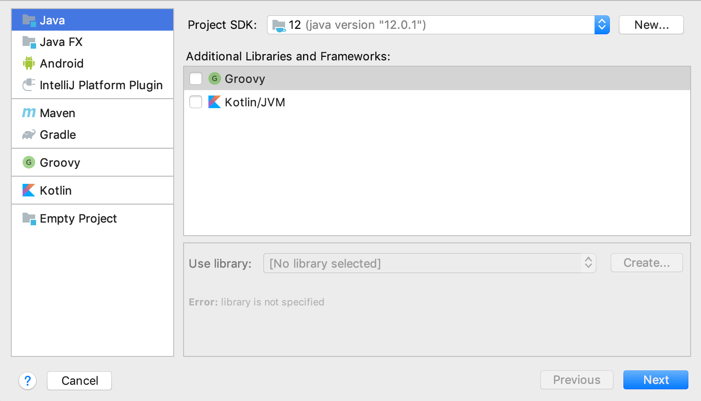
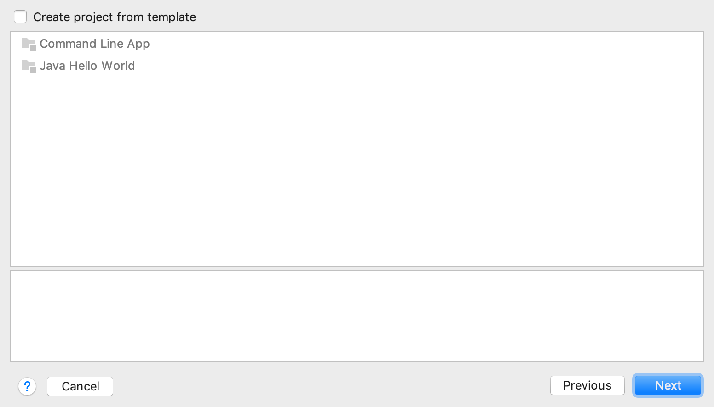
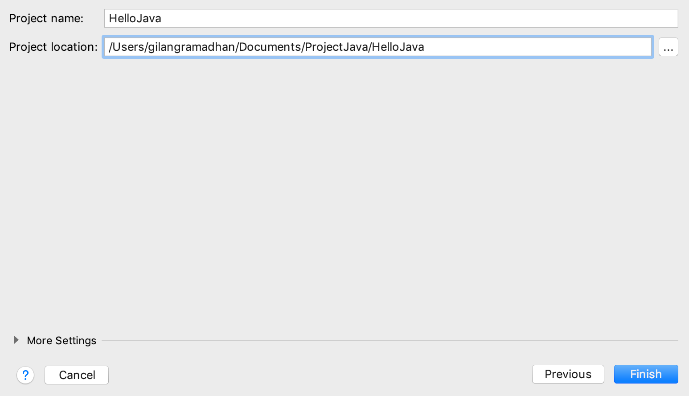
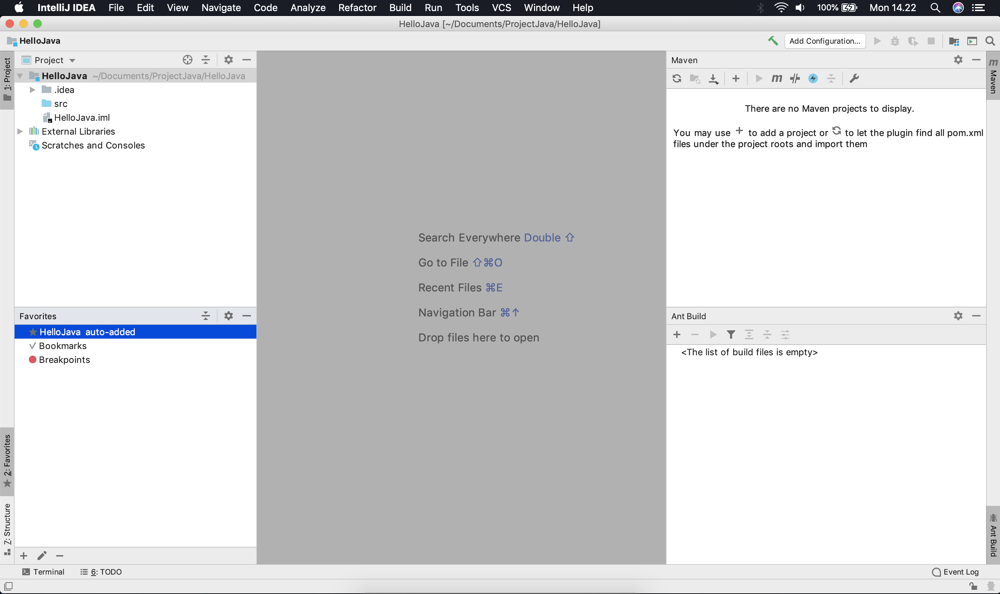
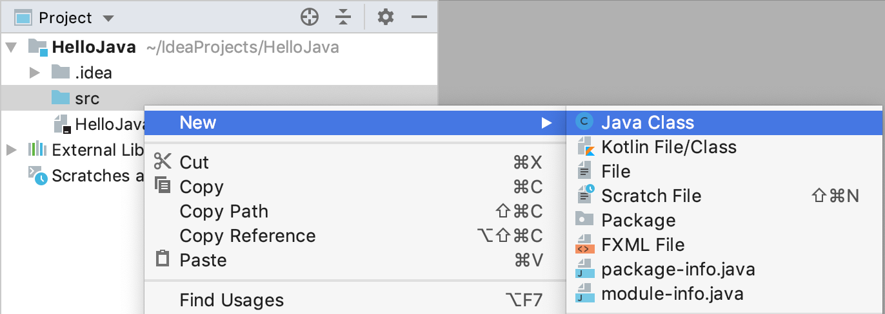
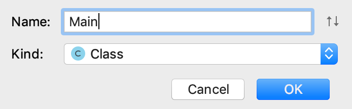
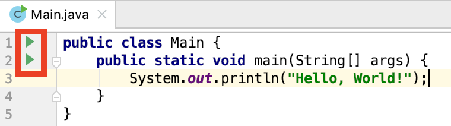
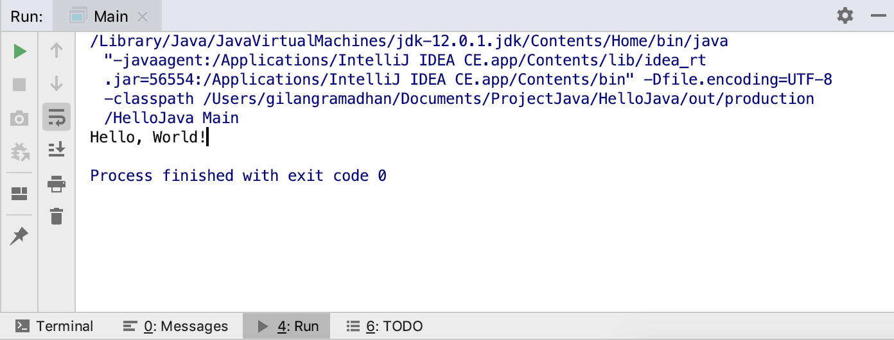

# Membangun Project Pertama Kali

## Tujuan
Setelah semua tools sudah siap, mari kita buat aplikasi sederhana yang disimpan dalam sebuah file ```Hello.java``. Kita akan menuliskan teks **Hello World!** di layar seperti ini:

## Codelab Membuat Proyek Baru
Ikuti langkah-langkah berikut ini:

1. Buka aplikasi ```IntelliJ```. Akan muncul *window* setup *wizard* seperti ini. Pilihlah **Create New Project**.

    Di dalam tampilan awal **IntelliJ**, terdapat beberapa pilihan menu, di antaranya:
    1. **Create New Project:** untuk membuat project baru.
    2. **Import Project:** untuk memasukan project yang telah di buat sebelumnya.
    3. **Open:** untuk Membuka folder yang sudah berisi aplikasi yang telah di buat.
    4. **Check out from Version Control:** digunakan untuk berkolaboratif dengan teman atau rekan kerja Anda.

2. Kemudian pilih **Next**.

3. Jika terdapat pilihan **Create project from template**, abaikan dan pilih **next**.

4. Ganti **Project location** ke *directory* folder yang Anda inginkan. Berilah **Project name**-nya **"HelloJava"**.

5. Tampilan utama aplikasi adalah seperti ini.


## Codelab Membuat Kelas Baru
Mari kita buat berkas baru dengan cara:

1. Klik kanan di bagian **src** kemudian pilih **New → New Java Class**. Lihatlah gambar di bawah ini:

2. Setelah itu akan muncul dialog seperti gambar di bawah ini, berilah nama ```Main```.

3. Tambahkan kode berikut ke dalam kelas ```Main``` yang telah kita buat.
    ```java
    public class Main {
        public static void main(String[] args) {
            System.out.println("Hello, World!");
        }
    }
    ```

## Codelab Menjalankan Kelas Main
Anda bisa menjalankan Aplikasi dengan cara berikut:

1. Tekanlah tanda *run* dengan **warna hijau** di sebelah kiri editor. Lihat gambar di bawah ini:

2. Setelah itu akan muncul *log* pada bagian bawah. Anda juga dapat melihat *output*-nya.
    ```
    Hello, World!
    ```
    

Selesai sudah materi *introduction*. Di sini kita sudah membahas banyak hal mengenai Java, JDK, IDE dan juga latihan membuat aplikasi **Hello World**. Jika Anda ingin mengetahui arti dari kode di atas Anda dapat membacanya pada tautan [ini](https://docs.oracle.com/javase/tutorial/getStarted/application/index.html).

----
[Sebelumnya](../02-tools/index.md)
[Selanjutnya]()